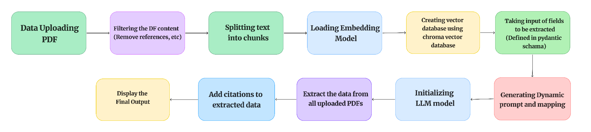

# Information Retrieval RAG For Data Extraction from Research Papers

This project is a **Retrieval-Augmented Generation (RAG)** system designed to extract scientific and technical information from research papers. The system is built to handle large-scale document processing, embedding-based retrieval, and context-aware responses, leveraging. The system features a hybrid retrieval pipeline, dynamic schema extraction, citation linking, multi-user chat history, and a modern Streamlit interface.

- Advanced **hybrid retrieval** (multi-query, self-query, ensemble, contextual compression)
- **Dynamic schema extraction** using runtime Pydantic model generation
- **Citation mapping** for transparent source linking
- **MongoDB-backed** user and chat management
- Full **Streamlit app** for user authentication, chat, and data extraction workflows

---

## Workflow Overview



### Step-by-step Pipeline:
1. **PDF Upload**: Bulk import of research papers.
2. **Content Filtering**: Removes non-essential sections (references, intro).
3. **Chunking & Metadata**: Splits and annotates text for retrieval.
4. **Embedding**: Uses HuggingFace transformer models for dense text representation.
5. **ChromaDB Vector Store**: Fast, persistent semantic search.
6. **Schema Input**: User defines fields to extract (UI form → dynamic Pydantic schema).
7. **Prompt Generation**: Automated, field-mapped prompt for extraction.
8. **Hybrid Retrieval**: Multi-query, self-query, ensemble, and contextual compression for robust context.
9. **LLM Extraction**: Uses Gemini, Ollama, or HuggingFace models for structured output.
10. **Citation Linking**: Maps extracted data to source documents.
11. **Display**: Structured and citation-linked output in UI; all chat history saved.

---

## Directory Structure

```plaintext
Information_Retrieval_RAG/
├── app.py                 # Streamlit UI—navigation, login, schema form, output
├── db.py                  # MongoDB: users, chat history, dynamic schema CRUD
├── dynamic_schema.py      # Runtime Pydantic model generation, schema prompts
├── ChatHistory.py         # Multi-chat history (MongoDB), analytics, export/import
├── document_loader.py     # PDF parsing (text, OCR, metadata extraction)
├── rag_assistant.py       # Core RAG pipeline: hybrid retrieval, extraction, citation
├── textsplitter.py        # Chunking, embedding (HuggingFace), ChromaDB store
├── scheme.py              # contains Pydantic models for data validation and Defines data schemas for extracted information (legacy)
├── gemini_scheme.py       # Gemini API schemas
├── citation.py            # Citation models (transparent, source-linked)
├── general_schema.py      # General extraction schemas
├── requirements.txt       # Dependencies
├── LICENSE                # License
├── README.md              # Documentation
├── feature_selection.py   # Streamlit: choose chat/structured/agenticRAG features
├── form.py                # Streamlit: dynamic schema definition form
├── structured_output.py   # Streamlit: RAG chat, output, chat creation
├── login.py               # Streamlit: OAuth login/profile
├── utils.py               # Utility functions (profile, hashing, etc.)
├── .env                   # Enviroment Variable
└── Logs/                  # Log files (auto-managed, periodic cleanup)
```

---

## Features

### 1. **Document Loading**
   - **Flexible Input Handling**:  
     - **`PyPDFLoader`**: Fast processing for text-heavy PDFs.
     - **`UnstructuredLoader`**: Extracts data from complex layouts, including OCR for image-based PDFs.
     - **`DoclingLoader`**: Ideal for metadata-driven structured extraction.
   - **Batch Processing**: Automatically scans directories for PDFs and loads them into memory.

### 2. **Text Processing**
   - **Chunking**: Uses `RecursiveCharacterTextSplitter` to split documents into smaller, manageable chunks for better embedding and retrieval.
   - **Embedding**: Utilizes HuggingFace's `BAAI/bge-base-en` model for generating dense embeddings compatible with FAISS.

### 3. **Vector Storage and Retrieval**
   - **Storage**: Implements ChromaDB for fast similarity searches on vectorized document chunks.
   - **Search Modes**: Supports Maximum Marginal Relevance (MMR) and similarity-based retrieval.
   - **Local Storage**: Local Storage: Saves and loads ChromaDB indices for persistent retrieval capabilities..

### 3. Hybrid Retrieval Pipeline
  - **Self-Query Retriever**: Filters results using document metadata (source, title, DOI).
  - **Multi-Query Retriever**: Generates multiple sub-queries for diverse context.
  - **Ensemble Retriever**: Combines and ranks results from multiple retrievers.
  - **Contextual Compression**: Reranks/filters with Flashrank for focused context.
  - **Iterative Retrieval**: Granular, document-by-document context retrieval.

### 4. Dynamic Schema Extraction
  - Users define schema fields (UI form → snake_case enforced).
  - **Dynamic Pydantic Model Generation**: Models built at runtime, stored per user/session in MongoDB.
  - Automated prompt creation and mapping for LLMs.
  - Schema selection and management via UI.

### 5. RAG Pipeline & LLM Integration
- **LLM Options**: Gemini (remote), HuggingFace (local), Ollama (local).
- Prompts combine history, examples, context docs.
- Output validated against user schema and linked to sources.
- **Citation Extraction**: Kor-based pipeline, transparent citation mapping.

### 6. Citation System (see `citation.py`)
  - Citations include: `Source_ID`, `Article_ID` (UUID), snippet, title, source filename.
  - Citations are validated via Pydantic and returned in structured JSON for transparency.

### 7. MongoDB Data Management (see `db.py`)
  - **User Model**: Handles OIDC user IDs, profile, dynamic schemas, chat sessions.
  - **Dynamic Schema CRUD**: Add/remove/update runtime Pydantic schemas per user.
  - **Chat History CRUD**: Multi-chat per user; titles, timestamps, export/import, deletion.
  - **Citation Data**: All extracted data and citations can be traced to user and chat session.

### 6. **Analytics and Summarization**
   - **Conversation Summarization**: Compresses older messages into concise summaries using LLMs.
   - **Topic Modeling**: Extracts main topics using TF-IDF and NMF for better insight into chat history.
   - **Statistics**: Provides analytics like total messages, average message length, and distribution between human and AI messages.

### 8. Chat History & Analytics (see `ChatHistory.py`)
  - Persistent MongoDB multi-chat per user.
  - Export/import, search, filter, anonymization, backup.
  - Chat statistics, topic modeling, summarization.

### 9. Logging & Error Handling
- Structured logging (file and console).
- Automated log cleanup (logs older than 1 day w/o errors, or 3 days always).

### 10. Streamlit App & UI
- Navigation: login (OAuth), feature selection, schema form, chat/output.
- Multi-user: profile, chat management, schema selection.
- Dynamic forms for schema definition.
- Contextual output and citation display.
### 9. **Logging & Error Handling**
  - Implements structured logging for debugging and performance monitoring.
  - Deletes old logs automatically if they do not contain errors.
  - If log is older than 3 days then it deletes the log even if log contain errors

---

## Dynamic Schema System (see `dynamic_schema.py`, `db.py`)

- Users define extraction schema via Streamlit form.
- System generates runtime Pydantic models for validation.
- Models and prompts stored per user/session in MongoDB.
- Schema can be updated, selected, or deleted.
- Prompts and output mapping auto-generated for field extraction.

**Example:**
```python
user_fields = {
    'numeric_value': "Numeric value from paper.",
    'switching_layer_material': "Material of switching layer.",
    # ... more fields
}
dynamic_schema = DynamicGenSchema.create_model(user_fields)
```
- Output is schema-validated and mapped to field names in UI.


---

## Installation

### Prerequisites
- Python 3.11+
- CUDA-enabled GPU (optional for faster processing with LLMs)
- Libraries (install via `requirements.txt`):
  
```bash
pip install -r requirements.txt
```

### Additional Tools
Need only if using `UnstructuredLoader`
- [Tesseract OCR](https://github.com/tesseract-ocr/tesseract) for OCR processing.
- Note: Do not forgot to add tesseract in enviroment variable after installation (For Windows)
---

## Usage

### Step 1: Prepare Your Documents
Place the research papers (PDFs) in a directory (default: `./PDF/`).

### Step 2: Add Your Gemini API Key
Before running the system, ensure you have a valid Gemini API key in `.env`.
```.env
GEMINI_API_KEY=""
MONGODB_URI="mongodb://127.0.0.1:27017/?directConnection=true&serverSelectionTimeoutMS=2000"
USER_COLLECTION_NAME="users"
CHAT_HISTORY_COLLECTION_NAME="chat_history"
DATABASE_NAME="IRAG"
```

### Step 3: Ollama Model download
If model is not Downloaded then run the following command
`ollama run hf.co/NousResearch/Hermes-3-Llama-3.2-3B-GGUF:Q6_K`
Link to Download Ollama: [Ollama](https://ollama.com/)

### Step 4: Run the RAG Pipeline
Execute the main script to start processing and querying:

```bash
streamlit run app.py
```
- **User Interface**: Login (Google OAuth), select features, define schema, upload PDFs, query RAG pipeline, view structured output and citations.

---

## Output Format

The RAG system provides responses in a structured JSON format (Sample output. Output will not be always be in this format):

```json
[
  {
      "data": [
          {
              "numeric_value": null,
              "switching_layer_material": "CuO",
              "synthesis_method": "null",
              "top_electrode": "Ag",
              "top_electrode_thickness": null,
              "bottom_electrode": null,
              "bottom_electrode_thickness": null,
              "switching_layer_thickness": null,
              "switching_type": null,
              "endurance_cycles": null,
              "retention_time": null,
              "memory_window": null,
              "num_states": null,
              "conduction_mechanism": null,
              "resistive_switching_mechanism": null,
              "paper_name": null,
              "doi": null,
              "year": 2020,
              "source": null,
              "additionalProperties": null
          }
      ]
  },
  {
    "data": [
        {
            "numeric_value": null,
            "switching_layer_material": "CuO",
            "synthesis_method": null,
            "top_electrode": "Ag",
            "top_electrode_thickness": null,
            "bottom_electrode": "p-Si",
            "bottom_electrode_thickness": null,
            "switching_layer_thickness": null,
            "switching_type": "resistive switching (RS)",
            "endurance_cycles": 50,
            "retention_time": null,
            "memory_window": null,
            "num_states": "2 (HRS and LRS)",
            "conduction_mechanism": null,
            "resistive_switching_mechanism": "Ag filament formation",
            "additionalProperties": null,
            "paper_name": "Memristive Devices from CuO Nanoparticles",
            "source": "1.pdf"
        }
    ]
  }
]

```
For citation response format:

```json
{
    "citations": [
        {
            "Source_ID": 0,
            "Article_ID": "8ca54a6f-30ed-4ef4-9927-700080b8a23b",
            "Article_Snippet": "function of the number of cycles, which show the co nsistency and stability in low resistive state (LRS) \nand high resistive state (HRS). The semi-log I-V curv es in Figure 3d give a more accurate picture of \nNDR and RS with a switching ratio of 103. \n\nFigure 3. (a) Current–voltage (I-V) curve of Ag/CuO/SiO 2/p-Si resistive switching and ( b) multiple \nresistive switching up to 50 cycles depicting reproducibility. The inset shows the formation of \nnegative differential resistance (NDR), ( c) endurance performance of Ag/CuO/SiO 2/p-Si, and ( d) semi-\nlog current–voltage characteristics of a multilayer Ag/CuO/SiO 2/p-Si showing NDR and on-off",
            "Article_Title": "Memristive Devices from CuO Nanoparticles",
            "Article_Source": "1.pdf"
        },
        {
            "Source_ID": 1,
            "Article_ID": "beea0861-2de7-4136-b9da-b7cb3b2212d8",
            "Article_Snippet": "Figure 3b shows a clear cut of the NDR. The current decreases sharply with an increase in potential.\nFigure 3c shows the endurance performance of the device. Resistance was taken as a function of\nthe number of cycles, which show the consistency and stability in low resistive state (LRS) and high\nresistive state (HRS). The semi-log I-V curves in Figure 3d give a more accurate picture of NDR and RS\nwith a switching ratio of 103.\nNanomaterials 2020 , 10, x FOR CONVERSION 4 of 9 \n The I-V characteristics in Figure 3a clearly show  the hysteresis curve, which demonstrates the \nnon-volatile resistive switching along with negative differential resistance. The voltage was swept",
            "Article_Title": "Memristive Devices from CuO Nanoparticles",
            "Article_Source": "1.pdf"
        },
        {
            "Source_ID": 2,
            "Article_ID": "47b089f6-de7a-48dc-92b2-045bbf121156",
            "Article_Snippet": "Nanomaterials 2020 ,10, 1677 4 of 10\nThe I-V characteristics in Figure 3a clearly show the hysteresis curve, which demonstrates the\nnon-volatile resistive switching along with negative di fferential resistance. The voltage was swept from\n0 » 3 V » 0 »−3 V » 0. A stable resistive switching (RS) is observed when the bias voltage sweeps from\n0 V to 3 V; the current switches from 10−6A to 10−3A at a set voltage of 1.7 V . The device maintains\na low resistive state (LRS) when the bias voltage sweeps back from positive (3 V) to negative ( −0.7\nV), NDR is observed at −0.8 V , and the device switches o ff. Figure 3b demonstrates repeatability in\nswitching up to 50 cycles, emphasizing the reproducibility and stability of the device. The inset in",
            "Article_Title": "Memristive Devices from CuO Nanoparticles",
            "Article_Source": "1.pdf"
        },
        {
            "Source_ID": 3,
            "Article_ID": "6edd1459-8aad-4937-bfb6-6d64d1da06f0",
            "Article_Snippet": "To further investigate the role of native oxide, p- Si, and Ag, we fabricated a device consisting of \nITO as the bottom electrode. Figure 6 shows the I-V characteristics of the device with Ag as a top \nelectrode and ITO as a bottom electr ode with CuO nanoparticles acting as an active layer. In the absence \nof SiO 2, the device showed resistive switching with out NDR. The switching was described by the \nformation of Ag filament based on the linear I-V ch aracteristics. The device did not show NDR in the \nabsence of oxide. The abrupt uncont rollable switching also  characterizes the absence of native oxide. \nThe results showed no NDR in the case of Ag/C uO/ITO, and we inferred that NDR in Ag/CuO/SiO 2/p-",
            "Article_Title": "Memristive Devices from CuO Nanoparticles",
            "Article_Source": "1.pdf"
        },
        {
            "Source_ID": 4,
            "Article_ID": "e54da728-8e6e-4cb3-8435-1fd7a22eeabf",
            "Article_Snippet": "injected current in response to applied voltage [27]. The interaction of the injected carriers in defect states affects the magnitude of current, which al so affects the current–vo ltage characteristics. \nFigure 3. (a) Current–voltage (I-V) curve of Ag /CuO/SiO 2/p-Si resistive switching and ( b) multiple\nresistive switching up to 50 cycles depicting reproducibility. The inset shows the formation of negative\ndifferential resistance (NDR), ( c) endurance performance of Ag /CuO/SiO 2/p-Si, and ( d) semi-log\ncurrent–voltage characteristics of a multilayer Ag /CuO/SiO 2/p-Si showing NDR and on-o ffconductance\nof 1×103in the positive region. The voltage was swept from −3 V to 3 V . The V setand V reset are 1.5 V\nand−0.65 V .",
            "Article_Title": "Memristive Devices from CuO Nanoparticles",
            "Article_Source": "1.pdf"
        },
        {
            "Source_ID": 5,
            "Article_ID": "93bcf96d-3ef8-4b5c-b891-b33d3716a30f",
            "Article_Snippet": "from 0 » 3 V » 0 » −3 V » 0. A stable resistive switching (RS) is observed when the bias voltage sweeps \nfrom 0 V to 3 V; the current switches from 10−6 A to 10−3 A at a set voltage of 1.7 V. The device \nmaintains a low resistive state (LRS) when the bias  voltage sweeps back from positive (3 V) to \nnegative ( −0.7 V), NDR is observed at −0.8 V, and the device switches off. Figure 3b demonstrates \nrepeatability in switching up to 50 cycles, emphasiz ing the reproducibility and stability of the device. \nThe inset in Figure 3b shows a clear cut of the ND R. The current decreases sharply with an increase \nin potential. Figure 3c shows the endurance perf ormance of the device. Resistance was taken as a",
            "Article_Title": "Memristive Devices from CuO Nanoparticles",
            "Article_Source": "1.pdf"
        },
        {
            "Source_ID": 6,
            "Article_ID": "bd69dcf5-6c25-4bc8-9e08-9a61550eefbe",
            "Article_Snippet": "ITO as the bottom electrode. Figure 6 shows the I-V characteristics of the device with Ag as a top \nelectrode and ITO as a bottom electrode with CuO nanopa rticles acting as an active layer. In the absence \nof SiO\n2, the device showed resistive switching with out NDR. The switching was described by the \nformation of Ag filament based on the linear I-V ch aracteristics. The device did not show NDR in the \nabsence of oxide. The abrupt uncont rollable switching also characteri zes the absence of native oxide. \nThe results showed no NDR in the case of Ag/C uO/ITO, and we inferred that NDR in Ag/CuO/SiO 2/p-",
            "Article_Title": "Memristive Devices from CuO Nanoparticles",
            "Article_Source": "1.pdf"
        },
        {
            "Source_ID": 7,
            "Article_ID": "7d481d67-b8b9-44e6-bdad-a97284670549",
            "Article_Snippet": "Received: 17 July 2020; Accepted: 23 August 2020; Published: 26 August 2020\n/gid00030/gid00035/gid00032/gid00030/gid00038/gid00001/gid00033/gid00042/gid00045 /gid00001\n/gid00048/gid00043/gid00031/gid00028/gid00047/gid00032/gid00046\nAbstract: Memristive systems can provide a novel strategy to conquer the von Neumann bottleneck\nby evaluating information where data are located in situ. To meet the rising of artificial neural\nnetwork (ANN) demand, the implementation of memristor arrays capable of performing matrix\nmultiplication requires highly reproducible devices with low variability and high reliability. Hence,\nwe present an Ag /CuO/SiO 2/p-Si heterostructure device that exhibits both resistive switching (RS)",
            "Article_Title": "Memristive Devices from CuO Nanoparticles",
            "Article_Source": "1.pdf"
        },
        {
            "Source_ID": 8,
            "Article_ID": "4e58a51e-be24-473c-a7ca-dd70657ebe8f",
            "Article_Snippet": "confined the filament rupture and reduced the reset variability. Reset was primarily influenced by\nthe filament rupture and detrapping in the native oxide that facilitated smooth reset and NDR in\nthe device. The resistive switching originated from traps in the localized states of amorphous CuO.\nThe set process was mainly dominated by the trap-controlled space-charge-limited; this led to a\ntransition into a Poole–Frenkel conduction. This research opens up new possibilities to improve the\nswitching parameters and promote the application of RS along with NDR.\nKeywords: CuO nanomaterials; negative di fferential resistance; Poole–Frenkel conduction; switching\nratio; resistive switching; space charge limited current\n2. Materials and Methods",
            "Article_Title": "Memristive Devices from CuO Nanoparticles",
            "Article_Source": "1.pdf"
        }
    ]
}

```
---
## Key Classes and Modules

### `rag_assistant.py` (Core RAG Pipeline)
- **`RAGChatAssistant`**: Main class orchestrating the RAG workflow.
  - **Methods**:
    - `create_vectors()`: Loads PDFs, chunks text, generates embeddings, and persists them in ChromaDB.
    - `retrieve_context()`: Implements a hybrid retrieval system:
      - **Self-Query Retriever**: Filters by metadata (source/title/DOI).
      - **Multi-Query Retriever**: Expands queries for richer context.
      - **Ensemble Retriever**: Combines multiple retrievers for robustness.
      - **Contextual Compression**: Reranks and compresses for focused context.
      - **Iterative Retrieval**: Optionally retrieves context per document.
    - `generate_response()`: Runs LLM (Gemini/Ollama/HuggingFace) for schema-validated extraction.
    - `create_prompt_template()`: Builds custom prompts from schema and chat context.
    - `extract_citations()`: Uses Kor-based processing for citation-linked output.

### `document_loader.py`
- **`DocLoader`**: Loads and parses PDFs.
  - `pypdf_loader`: Fast for text-based PDFs.
  - `unstructured_loader`: OCR for image-based or complex PDFs.
  - `docling_loader`: Extracts metadata and structured content.

### `dynamic_schema.py`
- **`DynamicGenSchema`**: Builds Pydantic models at runtime from user-defined fields.
  - `generate_dynamic_model()`: Creates extraction schema.
  - `generate_data_objects_model()`: Wraps schema in a response model.
  - `generate_dynamic_prompt()`: Generates instructions and mapping for LLM.
  - `create_model()`: Factory for dynamic model instantiation.

### `db.py`
- MongoDB handlers for persistent data:
  - `create_user()`, `get_user()`, `update_chat_ids()`: OAuth user management.
  - `get_pydantic_models()`, `update_pydantic_models()`, `delete_pydantic_model()`: Dynamic schema CRUD.
  - `get_chat_titles_and_ids()`, `delete_chat_id()`, `delete_chat_session()`: Chat management.
  - All user schemas and chats stored in MongoDB for multi-user support.

### `ChatHistory.py`
- **`ChatHistoryManager`**: Multi-chat management per user in MongoDB.
  - **Initialization**: Loads/saves all user chats via MongoDB.
  - **Methods**:
    - `create_new_chat()`, `load_chat()`: Chat session management.
    - `add_user_message()`, `add_ai_message()`, `add_citation_message()`: Adds messages (human, AI, citation).
    - `get_message_history()`, `get_citation_message()`: Retrieves chat history for context or citation.
    - `clear_history()`, `export_history()`, `list_user_histories()`: History management and analytics.
    - **Analytics**: History size, topic modeling, summarization, anonymization.

### `textsplitter.py`
- **`ProcessText`**: Text chunking and embedding pipeline.
  - `splitter`: Recursive chunking of documents.
  - `embeded_documents`: Generates embeddings for each chunk.
  - `vectore_store`: Persists embeddings in ChromaDB.

### `gemini_scheme.py`
- Defines structured output schemas for Gemini LLM responses.
  - **Models**: `Data_Objects`, other response models for validation.

### `scheme.py`, `general_schema.py`
- **Static Schemas**: Legacy Pydantic models for extraction and validation.
  - **Models**: `Extract_Text`, `Data`, `General_Extract_Text` (numeric extraction).

### `citation.py`
- **Citation Models & Processing**:
  - **`Citation`**: Model for individual citation (source ID, UUID, snippet, title, source).
  - **`Citations`**: List of citations; provides `.to_json_string()` for output.
  - Ensures transparent mapping from extracted data to original PDF source.

### UI Modules
- **`app.py`**: Streamlit UI, navigation, session state, logging.
- **`feature_selection.py`**: UI for choosing chat, structured or agenticRAG features.
- **`form.py`**: UI form for dynamic schema definition.
- **`structured_output.py`**: Output display and chat creation.
- **`login.py`**: Google OAuth login, profile management.
- **`utils.py`**: Utility helpers (profile, password hashing, etc).

---

## Future Work

- Implement dynamic schema generation for custom queries.
- AgenticRAG with live web search
- Develop Full Stack Application with Frontend for user intreaction on the web using React, Django and FastAPI.
- Enhanced analytics, team features
- Additional LLMs/retrievers
---

## Contributing

Contributions are welcome! To contribute:
1. Fork the repository.
2. Create a new branch.
3. Submit a pull request with your changes.

---

## Contact

For any questions or suggestions, feel free to contact on below Contact details:

- Om Nagvekar Portfolio Website, Email: https://omnagvekar.github.io/ , omnagvekar29@gmail.com
- GitHub Profile:
   - Om Nagvekar: https://github.com/OmNagvekar

---

## Citing the project
To cite this repository in publications:

```bibtex
@misc{Information_Retrieval_RAG,
  author = {Om Nagvekar},
  title = {Information Retrieval RAG For Data Extraction from Research Papers},
  year = {2025},
  howpublished = {\url{https://github.com/OmNagvekar/Information_Retrieval_RAG/}},
  note = {GitHub repository},
}
```
---

## License

This project is licensed under the [CC BY-NC 4.0 license](LICENSE).

---